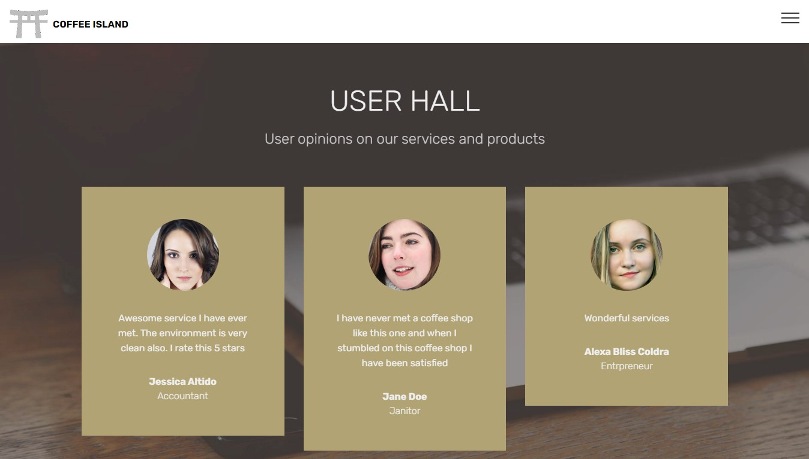
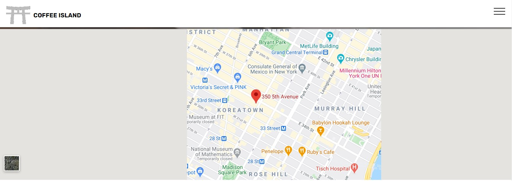

<h1>Coffee Island</h1>

 

This is a website made using `Mobirise 4` which is a template for a basic `restaurant` / `coffee stop`.

 **The actual source code is accessed through URI [`https://website-mania.github.io/coffee-island/`](https://website-mania.github.io/coffee-island/)**

<h2>Preview</h2>

